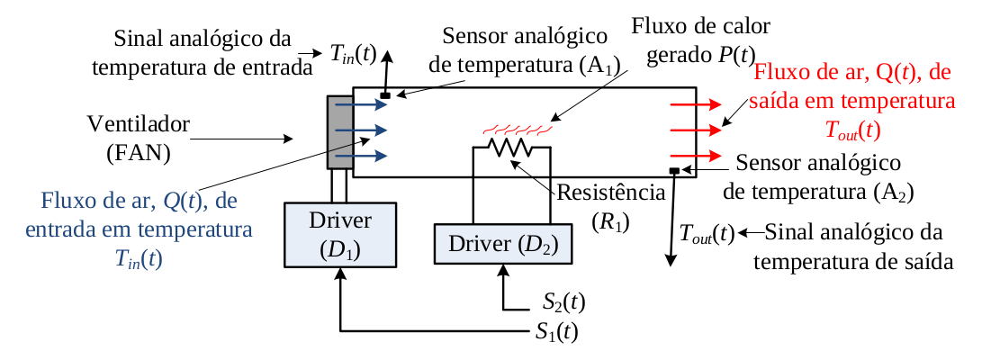

# secador_graos_prova

Programa feito para a resolução da prova da primeira unidade da disciplina DCA0119 - SISTEMAS DIGITAIS.

O secador de grãos foi desenvolvido com base no esquemático a baixo:

